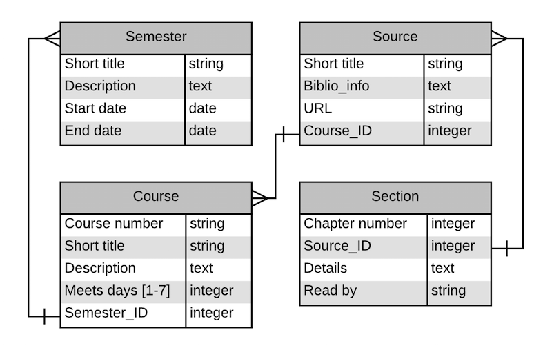

# &lsquo;Rolling Read&rsquo; web app

&lsquo;Rolling Read&rsquo; is short for &ldquo;Rolling Reading List&rdquo;.  The primary view in this app is a webpage that shows when reading assignments are due, and also lets the user check-off assignments then they are completed.

The user enters information about courses and source materials, such as textbooks, and when sections of those sources are assigned to be read.

## Tables

Sketch of tables and fields:

Sketch of default view:

![Default view](img/rollingread-default-view.png]

