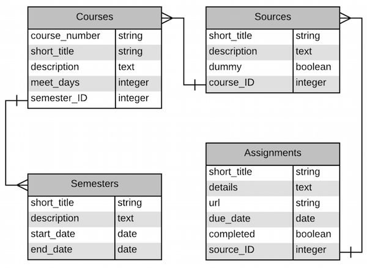
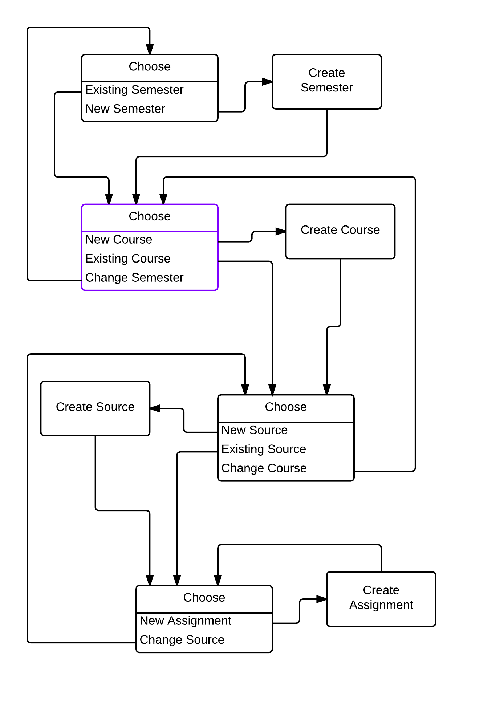

# &lsquo;Rolling Read&rsquo; web app

&lsquo;Rolling Read&rsquo; is short for &ldquo;Rolling Reading List&rdquo;.  The primary view in this app is a webpage that shows when reading assignments are due, and also lets the user check-off assignments then they are completed.

The user enters information about courses and source materials, such as textbooks, and when sections of those sources are assigned to be read.

Sketch of default view:

 
## Tables

###Sketch of tables and fields

### Scaffolds

* `rails generate scaffold Semester short_title:string description:text start_date:date end_date:date`

* `rails generate scaffold Course course_number:string short_title:string description:text meet_days:integer semester:belongs_to`

* `rails generate scaffold Source short_title:string description:text dummy:boolean course:belongs_to`

* `rails generate scaffold Assignment short_title:string details:text url:string due_date:date completed:boolean source:belongs_to`

----

### Types & validations

#### Semesters
| name        | type     | required? | validate         |
|-------------|----------|-----------|------------------|
| short_title | string   |     Y     | uniqueness       |
| description | text     |           |                  |
| start_date  | date     |     Y     |                  |
| end_date    | date     |     Y     | after start_date |
| id          |(implicit)|           |                  |

####Courses 
| name          | type     | required? | validate   |
|---------------|----------|-----------|------------|
| course_number | string   |           |            |
| short_title   | string   |     Y     | uniqueness |
| description   | text     |           |            |
| meet_days     | integer  |     Y     |            |
| semester      |belongs_to|     Y     |            |
| id            |(implicit)|           |            |

####Sources
| name        | type     | required? | validate                         |
|-------------|----------|-----------|----------------------------------|
| short_title | string   |     Y     | uniqueness (unless :is_dummy)    |
| description | text     |           |                                  |
| dummy       | boolean  |           | short_title in ("URL","Article") |
| course      |belongs_to|     Y     |                                  |
| id          |(implicit)|           |                                  |

#### Assignments
| name        | type     | required? | validate         |
|-------------|----------|-----------|------------------|
| short_title | string   |     Y     |                  |
| details     | text     |           |                  |
| url         | string   |           | well-formed      |
| due_date    | date     |     Y     | before Semester.end_date |
| completed   | boolean  |           |                  |
| source      |belongs_to|     Y     |                  |
| id          |(implicit)|           |                  |

### Fixtures

#### Semesters
| name        | spring      | fall      |
|-------------|-------------|-----------|
| short_title | S15         | F15       |
| description | Spring 2015 | Fall 2015 |
| start_date  | 12Jan15     | 19Aug15   |
| end_date    | 02May15     | 05Dec15   |

####Courses 
| name          | spring    | fall      |
|---------------|-----------|-----------|
| course_number | COM531    |  COM580   |
| short_title   | Web Apps  | Know-Mgt  |
| description   | … … … … … | … … … … … |
| meet_days     |  2        | 32        |
| semester      | spring    | fall      |

####Sources
| name        | spring    | fall      |
|-------------|-----------|-----------|
| short_title | AgileDev  | URL       |
| description | Ruby, S., Thomas, D., and D. H. Hansson. Agile Web Development with Rails 4. |  |
| dummy       | false     | true      |
| course      | spring    | fall      |

#### Assignments
| name        | spring     | fall         |
|-------------|------------|--------------|
| short_title | Chpt14     | Vid-Long_web |
| details     | Chapter 14 | Jeremy Keith, "The Long Web" |
| url         |            | http://aneventapart.com/news/post/the-long-web-by-jeremy-keith-an-event-apart-video |
| due_date    | 07Apr15    | 08Sep15      |
| completed   | false      | false        |
| source      | spring     | fall         |

----

### Days to bits

Store the days that a class meets as an integer between 1 and 127, by assigning a day to each bit of the integer in binary.

| Sun | Sat | Fri | Thu | Wed | Tue | Mon | &#8721; |
|-----|-----|-----|-----|-----|-----|-----|---------|
|  64 |  32 |  16 |   8 |   4 |   2 |   1 |     127 |
|   0 |   0 |   1 |   0 |   1 |   0 |   1 |      21 |
|   0 |   0 |   0 |   1 |   0 |   1 |   0 |      10 |

A class that meets Monday, Wednesday, Friday, would have an integer of 21.
A class that meets Tuesday, Thursday, would have an integer of 10.

## Sketch: flow through configuration/setup pages

