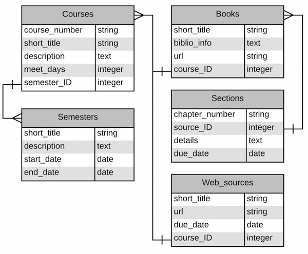
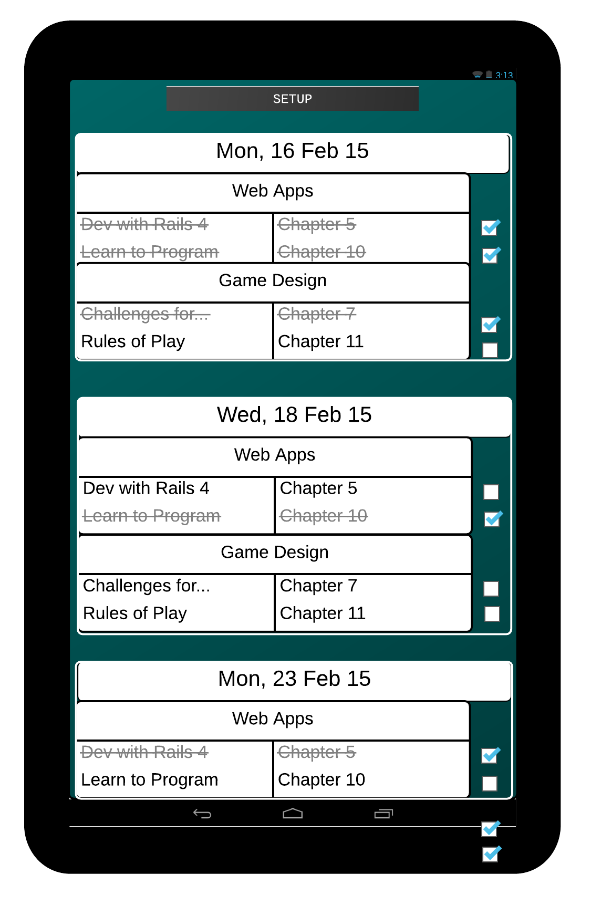

# &lsquo;Rolling Read&rsquo; web app

&lsquo;Rolling Read&rsquo; is short for &ldquo;Rolling Reading List&rdquo;.  The primary view in this app is a webpage that shows when reading assignments are due, and also lets the user check-off assignments then they are completed.

The user enters information about courses and source materials, such as textbooks, and when sections of those sources are assigned to be read.

## Tables

Sketch of tables and fields:

Sketch of default view:

## Scaffolds

* `rails generate scaffold Semester short_title:string description:text start_date:date end_date:date`

* `rails generate scaffold Course course_number:string short_title:string description:text meet_day1:boolean meet_day2:boolean meet_day3:boolean meet_day4:boolean meet_day5:boolean meet_day6:boolean meet_day7:boolean semester_id:integer`

* `rails generate scaffold Source short_title:string biblio_info:text url:string course_id:integer`

* `rails generate scaffold Section chapter_number:string details:text read_by:date completed:boolean source_id:integer`

----

## Validations/tests

#### Semesters

| name        | type   | required? | default | test |
|-------------|--------|-----------|---------|------|
| short_title | string |     Y     |         | uniqueness |
| description | text   |           |         |      |
| start_date  | date   |     Y     |         |      |
| end_date    | date   |     Y     |         | after start_date |

####Courses 

| name          | type    | required? | default | test |
|---------------|---------|-----------|---------|------|
| course_number | string  |           |         |      |
| short_title   | string  |     Y     |         | uniqueness |
| description   | text    |           |         |      |
| meet_day_bits | integer |     Y     |         |      |
| semester_id   | integer |     Y     |         | must exist |

####Sources

| name        | type    | required? | default | test |
|-------------|---------|-----------|---------|------|
| short_title | string  |     Y     |         | uniqueness |
| biblio_info | text    |           |         |      |
| url         | string  |           |         | is well-formed |
| course_id   | integer |     Y     |         | must exist |

#### Sections

| name           | type    | required? | default | test |
|----------------|---------|-----------|---------|------|
| chapter_number | string  |     Y     |         |      |
| details        | text    |           |         |      |
| read_by        | date    |     Y     |         | before Semester.end_date |
| completed      | boolean |           |  false  |      |
| source_id      | integer |     Y     |         | must exist |

